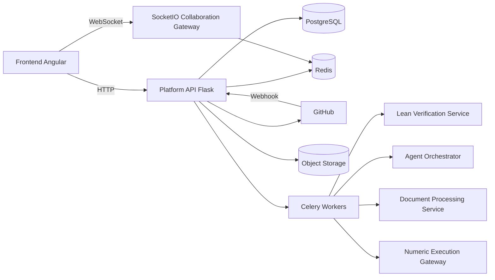

# Arquitectura ideal de la plataforma CoProof

## Propósito y alcance

Este documento define la arquitectura ideal de CoProof con un enfoque técnico: describir la estructura del sistema, los patrones de diseño que deben guiarlo, las buenas prácticas operativas y de código, los ciclos de vida principales del dominio y la forma en que esta arquitectura debe implementarse sobre el repositorio actual.

No se plantea una arquitectura teórica aislada del código. La propuesta está pensada para evolucionar la base existente en `server/`, `lean/` y `frontend/`, preservando los flujos ya implementados de validación Lean, creación de proyectos, manejo de nodos, integración con GitHub y ejecución asíncrona.

---

## Objetivo arquitectónico

La arquitectura ideal debe resolver cuatro tensiones del sistema:

1. Mantener a Git como fuente de verdad del contenido formal sin trasladar toda la lógica de plataforma al repositorio.
2. Permitir evolución funcional amplia sin convertir el backend en una colección de endpoints con lógica embebida.
3. Separar la computación pesada del flujo transaccional HTTP.
4. Hacer trazable el ciclo completo de una acción: solicitud, validación, propuesta, autorización, merge, reindexado y notificación.

La decisión central es usar un **modular monolith orientado a dominios para el backend principal**, complementado por **servicios especializados** para verificación formal y cómputo pesado.

---

## Descripción de la arquitectura

### Vista general

La arquitectura ideal se organiza en cuatro bloques:

1. **Frontend Web**: Angular como capa de experiencia, con vistas por dominio y estado orientado a casos de uso.
2. **Platform API**: backend principal en Flask, responsable de reglas de negocio, autorización, persistencia, coordinación y publicación de eventos.
3. **Servicios especializados**: Lean verification, orquestación de agentes, procesamiento documental y ejecución numérica.
4. **Infraestructura compartida**: PostgreSQL, Redis, almacenamiento de artefactos y GitHub.

La plataforma no necesita una fragmentación temprana en microservicios. El backend debe seguir siendo una unidad desplegable, pero internamente modularizada por dominios y con fronteras claras.

### Principio de fuente de verdad dual

El sistema debe asumir dos tipos de verdad:

- **verdad documental y formal**: archivos Lean, LaTeX y artefactos versionados en Git/GitHub;
- **verdad operacional**: usuarios, membresías, estados de nodos, sesiones, jobs, solicitudes, notificaciones y auditoría en PostgreSQL.

Git conserva la trazabilidad del contenido matemático. PostgreSQL conserva la trazabilidad del comportamiento de la plataforma.

### Separación entre lectura y escritura

La arquitectura debe distinguir claramente dos rutas:

- **ruta de lectura**: consultas rápidas a PostgreSQL, Redis o índices derivados para catálogo, grafo, linaje, actividad y estado de jobs;
- **ruta de escritura**: operaciones de negocio que pasan por servicios, validación, transacción y eventual sincronización con Git y servicios externos.

Esta separación permite que la interfaz sea rápida sin sacrificar integridad en operaciones complejas.

---

## Componentes y responsabilidades

### 1. Frontend Angular

Debe organizarse por dominios funcionales y no por páginas aisladas.

Responsabilidades:

- autenticación y manejo de sesión local,
- navegación por proyectos y workspaces,
- render del DAG y detalle de nodos,
- formularios de edición, validación y solicitudes,
- suscripción a eventos en tiempo real,
- visualización de actividad, errores y notificaciones.

En el código actual, `frontend/src/app/task.service.ts` ya funciona como punto de integración HTTP. La evolución ideal es dividirlo en servicios más específicos:

- `auth-api.service.ts`
- `projects-api.service.ts`
- `nodes-api.service.ts`
- `collaboration-api.service.ts`
- `jobs-api.service.ts`

Esto reduce acoplamiento y evita concentrar todo el contrato del sistema en un único archivo.

### 2. Platform API

Es el núcleo transaccional del sistema. Debe ser responsable de:

- autenticación y autorización,
- aplicación de reglas de negocio,
- persistencia del estado de la plataforma,
- integración con GitHub y Git local,
- coordinación de validación Lean,
- creación y seguimiento de jobs,
- publicación de eventos de dominio,
- consistencia entre cambio solicitado y cambio oficial.

En el código actual, la inicialización en `server/app/__init__.py` ya aporta una base válida:

- `Application Factory`,
- registro centralizado de extensiones,
- CORS,
- integración de SocketIO,
- configuración de Celery con colas dedicadas.

La mejora necesaria no es cambiar la tecnología, sino reorganizar el backend en módulos de dominio explícitos.

### 3. Lean Verification Service

Debe permanecer aislado del backend principal porque:

- tiene dependencias específicas del toolchain Lean,
- puede requerir límites de tiempo y memoria distintos,
- debe escalar de forma independiente,
- su salida debe ser reproducible y estable.

En el repositorio, `lean/tasks.py` y `lean/lean_service.py` ya modelan esta separación. La arquitectura ideal conserva esa decisión y la fortalece con un contrato uniforme para validación de snippets, archivos y proyectos completos.

### 4. Git Integration Layer

Es el subsistema responsable de coordinar repositorios, ramas, commits, PRs, worktrees efímeros y webhooks.

Debe vivir conceptualmente como infraestructura interna del backend, no como lógica dispersa en endpoints.

En el código actual ya existen piezas correctas:

- `RepoPool`
- `git_transaction`
- `read_only_worktree`
- integración con GitHub desde servicios de negocio

La arquitectura ideal exige consolidarlas detrás de servicios internos estables, para que la API no conozca detalles de clonación, paths temporales o push.

### 5. Collaboration Gateway

Debe manejar presencia, membresía de sala, sincronización de actividad viva y progreso de operaciones largas.

Puede comenzar embebido en el backend principal usando SocketIO, como ya se sugiere en la configuración actual, pero debe tener frontera propia para que la colaboración no termine mezclada con endpoints REST.

### 6. Job Orchestrator

Toda operación larga debe quedar representada como job observable. Esto aplica a:

- verificación pesada,
- traducción de prueba externa,
- generación por agente,
- ejecución numérica,
- reindexado,
- operaciones Git de larga duración.

El backend crea el job, los workers ejecutan, y el frontend observa estado y resultado por polling o WebSocket.

---

## Patrones de diseño recomendados

### 1. Application Factory

Debe mantenerse como patrón base del backend Flask. Ya está implementado y es correcto para:

- aislar configuración por entorno,
- inicializar extensiones de forma consistente,
- facilitar tests e instancias separadas.

### 2. Arquitectura por capas

Debe preservarse una dirección clara de dependencias:

- API
- servicios de aplicación
- dominio/modelos
- infraestructura

La capa API no debe contener lógica de negocio sustantiva. Su función es validar entrada básica, invocar servicios y serializar salida.

### 3. Modular Monolith por dominios

Es el patrón principal recomendado para el backend.

La organización ideal dentro de `server/app/` debe aproximarse a algo como:

```text
app/
    domains/
        auth/
        projects/
        nodes/
        changes/
        collaboration/
        jobs/
        notifications/
    infrastructure/
        db/
        git/
        github/
        lean/
        cache/
        events/
    api/
    extensions.py
    __init__.py
```

No es obligatorio migrar todo de inmediato, pero esta es la dirección correcta para evitar un backend plano y frágil.

### 4. Service Layer

Cada caso de uso importante debe ejecutarse a través de un servicio explícito. Ejemplos:

- crear proyecto,
- resolver nodo,
- dividir nodo,
- enviar solicitud de cambio,
- aprobar merge,
- reindexar proyecto.

Esto permite que las reglas de negocio se prueben sin depender del transporte HTTP.

### 5. Adapter / Gateway

Toda integración externa debe encapsularse detrás de adaptadores.

Aplicaciones concretas:

- GitHub REST API,
- servicio Lean,
- clúster numérico,
- proveedores de agentes,
- almacenamiento de artefactos.

En el código actual, `CompilerClient` ya refleja bien esta idea y debe tomarse como referencia para otras integraciones.

### 6. Producer-Consumer

Celery y Redis deben seguir usándose para desacoplar ejecución pesada del request/response.

Las tareas asíncronas no son un detalle de implementación; son parte del modelo operativo de la plataforma.

### 7. Unit of Work transaccional sobre Git

La escritura en repositorios debe seguir una secuencia controlada:

1. obtener lock,
2. preparar worktree efímero,
3. verificar cambios,
4. escribir archivos,
5. validar si corresponde,
6. commit/push,
7. cleanup,
8. actualizar estado derivado.

Ese patrón ya aparece parcialmente en el backend y debe preservarse como política obligatoria.

### 8. Outbox y eventos de dominio

Para jobs, notificaciones, reindexado y actividad, conviene usar un outbox transaccional. La idea es simple: primero se confirma el estado del negocio en PostgreSQL y luego se publica el evento de forma fiable.

Esto evita inconsistencias entre “la base dice que pasó” y “ningún worker se enteró”.

### 9. CQRS pragmático

No se requiere un CQRS completo, pero sí separar las consultas optimizadas de las rutas de comando.

Ejemplos:

- `GET /projects/public` y `GET /graph/simple` deben seguir siendo rutas de lectura simples y rápidas;
- `POST /projects`, `POST /solve`, `POST /split`, `POST /merge` deben permanecer como comandos con validación y orquestación.

### 10. Saga ligera para flujos largos

Flujos como creación de proyecto, aprobación de cambios o traducción externa no deben verse como una sola transacción técnica. Deben modelarse como un ciclo de estados compensables y observables.

---

## Buenas prácticas arquitectónicas y de implementación

### Cohesión por dominio

Cada módulo debe agrupar:

- modelos,
- servicios,
- esquemas,
- eventos,
- tareas,
- validadores,
- adaptadores específicos.

No conviene seguir acumulando comportamiento transversal en archivos API extensos.

### Contratos explícitos y estables

Toda integración entre backend, frontend y servicios especializados debe usar contratos consistentes para:

- errores,
- estados,
- jobs,
- validación Lean,
- propuestas y solicitudes.

El objetivo es evitar respuestas ad hoc por endpoint.

### Modelos activos únicos

La implementación debe converger a un único conjunto de modelos de dominio. En el estado actual aún se observa convivencia entre modelos antiguos y nuevos. La arquitectura ideal requiere eliminar gradualmente esa dualidad para evitar reglas duplicadas y rutas ambiguas.

### Estados explícitos

Los ciclos de vida no deben depender de banderas implícitas ni de inferencias por ausencia de datos. Proyectos, nodos, jobs, solicitudes y sesiones deben tener estados explícitos y transiciones válidas bien definidas.

### Idempotencia

Las operaciones que interactúan con GitHub, workers o webhooks deben ser idempotentes siempre que sea posible. Esto es especialmente importante en:

- merge de PR,
- reindexado,
- actualización de estado de jobs,
- recepción de webhooks,
- reprocesamiento de tareas fallidas.

### Observabilidad desde el diseño

Cada caso de uso relevante debe emitir:

- logs estructurados,
- identificador de correlación,
- métricas de latencia,
- estado de resultado,
- contexto mínimo de proyecto, nodo y job.

### Seguridad por defecto

Buenas prácticas obligatorias:

- JWT con refresh y expiración corta para access tokens,
- verificación fuerte de permisos por proyecto,
- validación HMAC de webhooks,
- secretos fuera del código,
- límites de tasa para endpoints públicos y sensibles,
- aislamiento de ejecución para Lean y procesamiento documental.

### Separación entre validación de entrada y validación de dominio

La API valida estructura y tipos. Los servicios validan invariantes del negocio. Esa separación evita duplicación y reduce rutas inconsistentes.

---

## Ciclos de vida principales

### Ciclo de vida de un proyecto

Estados sugeridos:

- `draft`
- `active`
- `locked`
- `archived`
- `error`

Secuencia ideal:

1. creación de metadatos,
2. prevalidación Lean del contexto objetivo,
3. inicialización del repositorio,
4. creación del nodo raíz,
5. indexación inicial,
6. activación del proyecto.

Si falla cualquiera de los pasos intermedios, el sistema debe dejar evidencia del fallo y permitir reintento o limpieza controlada.

### Ciclo de vida de un nodo

Estados base sugeridos:

- `pending`
- `sorry`
- `in_review`
- `validated`
- `blocked`

Transiciones típicas:

- un nodo nace desde creación de proyecto o split,
- entra en `sorry` cuando existe estructura pero no solución válida,
- pasa a `in_review` cuando hay propuesta o solicitud,
- pasa a `validated` tras merge y recalculo de consistencia,
- puede volver a `sorry` si una descomposición o cambio padre así lo exige.

Las reglas de propagación a ancestros e hijos deben quedar centralizadas en un servicio de dominio y no distribuidas entre rutas HTTP.

### Ciclo de vida de una solicitud de cambio

Estados sugeridos:

- `draft`
- `submitted`
- `validating`
- `awaiting_review`
- `approved`
- `rejected`
- `merged`
- `failed`

La `ChangeRequest` debe ser el objeto principal del proceso, incluso si además existe una rama o PR en GitHub.

### Ciclo de vida de un job asíncrono

Estados sugeridos:

- `queued`
- `running`
- `succeeded`
- `failed`
- `cancelled`
- `expired`

Todo job debe registrar:

- tipo,
- actor que lo inició,
- recurso asociado,
- timestamps,
- resultado resumido,
- artefactos generados,
- errores normalizados.

### Ciclo de vida de una sesión colaborativa

Estados sugeridos:

- `opening`
- `active`
- `degraded`
- `closed`

La sesión debe mantener participantes, nodo o workspace activo, heartbeats, presencia y eventos clave. Redis puede servir para estado efímero; PostgreSQL debe guardar los eventos y cierres relevantes.

---

## Implementación en el contexto del código actual

### Backend `server/`

La implementación actual ya contiene piezas compatibles con la arquitectura objetivo:

- `server/app/__init__.py` como punto de composición,
- `server/app/api/` como capa de entrada HTTP,
- `server/app/services/` como inicio de capa de servicios,
- `server/app/models/` para persistencia,
- `server/app/tasks/` y workers para asíncronos,
- integración con Redis, Celery, SocketIO y PostgreSQL.

La implementación ideal no requiere reemplazar Flask. Requiere reorganizar la estructura de negocio.

Dirección recomendada:

1. mover lógica compleja fuera de `app/api/*.py`,
2. consolidar servicios por caso de uso y por dominio,
3. encapsular Git, GitHub y Lean en adaptadores internos bien definidos,
4. introducir entidades faltantes como `ChangeRequest`, `ActivityEvent` y `Notification`,
5. normalizar el modelo activo en torno a la línea `NewProject` y `NewNode` o su sucesor definitivo.

### Servicio Lean `lean/`

El servicio Lean ya está bien separado del backend principal y debe mantenerse así.

Buenas prácticas específicas:

- contrato único de entrada y salida,
- aislamiento de archivos temporales,
- límites de tiempo configurables,
- respuestas estructuradas por error, línea y archivo,
- versionado del entorno Lean y Mathlib.

El backend no debe reconstruir semántica de compilación por su cuenta. Debe tratar al servicio Lean como autoridad técnica de validación.

### Frontend `frontend/`

La implementación actual en Angular es válida como base, pero necesita modularización por dominio y separación de responsabilidades.

Dirección recomendada:

- mover autenticación y tokens a un servicio dedicado,
- separar acceso HTTP por bounded context,
- agregar capa para WebSocket y eventos en tiempo real,
- mantener DTOs cerca del dominio que consumen,
- evitar que la lógica de interpretación de estados viva dispersa en componentes.

### Integración entre componentes

La forma correcta de implementar el sistema en el código es:

1. el frontend emite comandos o consultas,
2. la API valida entrada mínima y autentica,
3. el servicio de dominio ejecuta la regla de negocio,
4. si se necesita infraestructura externa, usa un adapter,
5. si la operación es larga, crea un job y despacha tarea,
6. el estado final se persiste y publica como evento,
7. el frontend observa el cambio por consulta o tiempo real.

Ese ciclo debe ser uniforme en auth, proyectos, nodos, agentes y validación externa.

---

## Vista de despliegue recomendada



---

## Evolución recomendada

### Fase 1. Orden interno del backend

- consolidar dominios,
- reducir lógica en endpoints,
- normalizar modelos activos,
- unificar contratos de errores y validación.

### Fase 2. Ciclos de vida explícitos

- introducir `ChangeRequest`, `ActivityEvent`, `Notification` y `AsyncJob` consistentes,
- formalizar estados y transiciones,
- agregar auditoría funcional.

### Fase 3. Tiempo real y colaboración

- activar canal SocketIO con eventos definidos,
- modelar presencia y sesiones,
- integrar progreso de jobs y notificaciones.

### Fase 4. Capacidades avanzadas

- orquestación de agentes por intención,
- pipeline documental,
- integración completa con clúster numérico,
- búsqueda y linaje enriquecidos.

---

## Conclusión

La arquitectura ideal de CoProof debe entenderse como una evolución disciplinada del código existente: un backend Flask modular por dominios, un servicio Lean especializado, workers para procesos largos, integración Git/GitHub encapsulada y un frontend Angular desacoplado por contextos funcionales.

Los patrones correctos ya están parcialmente presentes en el repositorio. El trabajo pendiente no es cambiar de stack, sino completar la separación de responsabilidades, formalizar ciclos de vida, estabilizar contratos y convertir la lógica actual en una arquitectura coherente, observable y mantenible.