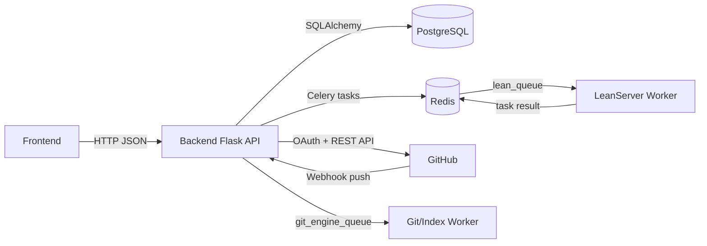

# Arquitectura del proyecto

## Objetivo y alcance

La arquitectura separa responsabilidades para mantener desacoplados el motor de verificación formal, la orquestación de negocio y la colaboración externa sobre repositorios. El sistema se centra en tres capacidades:

- verificar pruebas y contexto Lean con un servicio especializado,
- administrar proyectos, nodos y estados desde una API backend,
- usar GitHub como fuente de verdad para versionado, pull requests y sincronización.

El alcance de este documento corresponde al estado implementado en el repositorio: backend Flask en `server/`, servicio Lean en `lean/`, frontend Angular en `frontend/` e integración con GitHub por OAuth y REST.

---

## Componentes y responsabilidades

### Backend Flask (`server/`)

Actúa como punto de entrada HTTP y coordinador entre base de datos, GitHub y LeanServer.

- expone endpoints de auth, proyectos, nodos y webhooks,
- aplica reglas de negocio en servicios (`ProjectService`, `AuthService`, `CompilerClient`),
- persiste estado de dominio en PostgreSQL (`NewProject`, `NewNode`, `User`),
- usa Redis/Celery para ejecución asíncrona.

### LeanServer (`lean/`)

Se encarga de la validación formal de código Lean en aislamiento.

- consume tareas `tasks.verify_snippet` y `tasks.verify_project_files`,
- ejecuta Lean sobre archivos temporales,
- parsea mensajes de compilación,
- retorna una respuesta normalizada (`valid`, `errors`, tiempos y conteos).

### Integración con GitHub

Se utiliza para autenticación OAuth y como repositorio remoto del contenido Lean.

- OAuth para obtener identidad/token del usuario,
- API REST para crear repositorios, actualizar archivos y gestionar PRs,
- webhook `push` para disparar reindexado asíncrono.

---

## Patrones de diseño aplicados

### Arquitectura por capas (patrón principal)

Definición: organización en capas con dependencias dirigidas, donde cada capa expone contratos y concentra una responsabilidad.

Partes y correspondencia en el proyecto:

1. Capa API (entrada/salida HTTP)
   - Archivos: `server/app/api/projects.py`, `server/app/api/nodes.py`, `server/app/api/auth.py`, `server/app/api/webhooks.py`.
   - Rol: validar payloads iniciales, invocar servicios y serializar respuesta.

2. Capa de aplicación/servicios (orquestación de casos de uso)
   - Clases/métodos: `ProjectService.create_project`, `AuthService.handle_github_callback`, `CompilerClient.verify_snippet`, `CompilerClient.verify_project_files`.
   - Rol: coordinar reglas de negocio y llamadas a infraestructura.

3. Capa de dominio/datos (estado persistente)
   - Modelos: `NewProject`, `NewNode`, `User`.
   - Rol: representar entidades, relaciones y estados.

4. Capa de infraestructura (tecnología externa)
   - Git: `RepoPool`, `git_transaction`, `read_only_worktree`.
   - Colas: Celery/Redis (`lean_queue`, `git_engine_queue`).
   - Verificación: `lean/lean_service.py`.
   - Integración remota: GitHub REST.

Regla operativa aplicada: API → Servicios → Dominio/Infraestructura.

### Application Factory

`create_app` centraliza creación de la aplicación y registro de extensiones/blueprints. Esto concentra la configuración por entorno y evita inicialización dispersa.

### Productor–consumidor con colas

El backend publica tareas y workers especializados las consumen.

- Productores: backend (`CompilerClient`, tareas de git/indexado).
- Consumidor Lean: worker en `lean_queue`.
- Consumidor backend: workers en `git_engine_queue`.
- Broker/backend: Redis.

### Adapter/Gateway de integraciones

Se encapsulan protocolos externos tras interfaces internas:

- `CompilerClient` abstrae RPC por Celery hacia LeanServer,
- `AuthService` y helpers de servicios/API encapsulan llamadas a GitHub.

### Transaction Script sobre Git

Las operaciones de lectura/escritura en repos se encapsulan en unidades transaccionales:

- `read_only_worktree(...)` para validación sin persistencia,
- `git_transaction(...)` para edición, commit/push y cleanup.

### Control de concurrencia por locking distribuido

`acquire_project_lock` y `acquire_branch_lock` evitan condiciones de carrera en operaciones Git concurrentes.

### Propagación de estado en árbol de nodos

El estado de `NewNode` (`sorry`, `validated`) se propaga por reglas:

- una solución válida puede marcar el nodo objetivo como `validated`,
- un split puede devolver nodos a `sorry` hasta completar subpruebas,
- `_propagate_parent_states` recalcula el estado de ancestros según hijos.

### Sincronización orientada a eventos

El webhook de GitHub (`push`) dispara reindexado asíncrono (`async_reindex_project`) con validación HMAC.

---

## Flujos operativos principales

### Autenticación

1. Frontend solicita URL OAuth (`GET /api/v1/auth/github/url`).
2. Usuario autoriza y frontend recibe `code`.
3. Frontend envía `code` a backend (`POST /api/v1/auth/github/callback`).
4. `AuthService.handle_github_callback` intercambia token, sincroniza usuario y emite JWT interno.
5. Renovación con refresh token (`POST /api/v1/auth/refresh`).

### Creación de proyecto

1. Frontend envía `POST /api/v1/projects`.
2. `ProjectService.create_project` valida datos y token GitHub.
3. Se valida contexto Lean del objetivo con `CompilerClient.verify_snippet`.
4. Se crea repositorio remoto y archivos iniciales (`Definitions.lean`, `root/main.lean`, `root/main.tex`).
5. Se persisten `NewProject` y nodo raíz `NewNode`.

### Plan de validación para nodo (split)

1. Frontend envía `POST /api/v1/projects/{project_id}/nodes/{node_id}/split`.
2. `nodes.split_node` analiza bloques Lean y construye archivos derivados.
3. Se compone payload de verificación con contexto del proyecto.
4. `CompilerClient.verify_snippet` valida antes de cualquier PR.
5. Si compila, se crea rama, se escriben archivos y se abre pull request.

### Solución de nodo (solve)

1. Frontend envía `POST /api/v1/projects/{project_id}/nodes/{node_id}/solve`.
2. `nodes.solve_node` reconstruye contexto por árbol de imports.
3. Se verifica con LeanServer.
4. Si no hay cambios efectivos, se actualiza estado en DB sin PR.
5. Si hay cambios, se crea rama y pull request.

### Validación Lean involucrada

- Validación de snippet: `CompilerClient.verify_snippet` → `tasks.verify_snippet` → `lean_service.verify_lean_proof`.
- Validación de proyecto: `CompilerClient.verify_project_files` → `tasks.verify_project_files` → `lean_service.verify_lean_project`.

En ambos casos, la salida se normaliza en un contrato común de errores y métricas.

### Merge y actualización de estados

1. Frontend solicita `POST /api/v1/projects/{project_id}/pulls/{pr_number}/merge`.
2. Backend consulta y mergea PR en GitHub.
3. Se parsea metadata del PR.
4. `_apply_post_merge_db_updates` aplica transición de estados y creación/actualización de nodos según acción.

---

## Modelo de dominio y relaciones

### Entidades principales

- `NewProject`: datos del proyecto, configuración de objetivo, repositorio remoto, autor y colaboradores.
- `NewNode`: unidad de trabajo/progreso en el DAG lógico, con jerarquía padre-hijo y estado.
- `User`: identidad local y vínculo OAuth/token con GitHub.

### Relaciones clave

- `NewProject` 1..* `NewNode`.
- `NewNode` tiene autorrelación (`parent` / `children`).
- `User` se vincula a proyectos por autoría y colaboración.

---

## Comunicación entre clases y métodos

Mapa resumido de invocaciones relevantes:

1. `projects.create_project` → `ProjectService.create_project`.
2. `ProjectService._validate_goal_context` → `CompilerClient.verify_snippet`.
3. `nodes.verify_node_import_tree` → `CompilerClient.verify_snippet`.
4. `nodes.solve_node` → `RepoPool.ensure_repo_exists/update_repo` → `read_only_worktree` → `CompilerClient.verify_snippet` → `git_transaction` → `_open_pull_request`.
5. `nodes.split_node` → `_extract_lemma_blocks/_build_split_files` → `CompilerClient.verify_snippet` → `git_transaction` → `_open_pull_request`.
6. `nodes.merge_pull_request` → `_get_pull_request/_merge_pull_request` → `_apply_post_merge_db_updates`.
7. `webhooks.github_webhook` → `async_reindex_project.delay` → `GraphIndexer.reindex_project`.

---

## Organización del frontend

El frontend Angular implementa una estructura de componentes con servicio central de acceso API.

- Vistas principales: `AuthPageComponent`, `CreateProjectPageComponent`, `OpenWorkspacePageComponent`, `WorkspacePageComponent`.
- Servicio de integración HTTP: `TaskService`.
- Ruteo de navegación: `app.routes.ts`.

Bajo un marco MVC práctico:

- Vista: componentes (render y captura de interacción),
- Controlador: lógica de coordinación de flujo en componentes/servicio,
- Modelo: DTOs y estado transferido desde backend.

Esta organización ya se conecta con los endpoints actuales de auth, proyectos, nodos, verificación y merge sin requerir cambios de contrato en la API.

---

## Vista global de comunicación

---

## Decisiones arquitectónicas y trade-offs

- Verificación Lean fuera del backend: mayor aislamiento y escalado, con mayor complejidad operativa de colas y timeouts.
- GitHub como fuente de verdad: trazabilidad y colaboración robustas, con dependencia de red y límites del proveedor.
- Caché bare local de repos: mejora de rendimiento en operaciones repetidas, con necesidad de locking y disciplina transaccional.
- Reindexado por webhook: consistencia eventual entre remoto e índice local.
