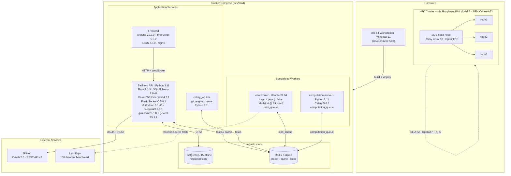

# Materials and Methods — CoProof (Draft)

## Materials

CoProof was developed and deployed across two hardware tiers. The development host was an x86-64 workstation running Windows 11; the computation cluster comprised four Raspberry Pi 4 Model B units (ARM Cortex-A72, 64-bit) connected over a private LAN (192.168.1.0/24), provisioned with Rocky Linux 10 (aarch64) and managed through OpenHPC, SLURM as the workload scheduler, and OpenMPI for distributed execution. All platform services were containerized with Docker and orchestrated via Docker Compose. The persistence layer used PostgreSQL 15 (Alpine) as the relational store and Redis 7 (Alpine) as both the message broker and distributed cache. The backend API was implemented in Python 3.11 (Debian Bookworm slim container) with Flask 3.1.3, SQLAlchemy 2.0.47, and Flask-Migrate 4.1.0 (Alembic) for schema management; psycopg2-binary 2.9.11 served as the PostgreSQL adapter. Authentication relied on JWT tokens issued through Flask-JWT-Extended 4.7.1, with GitHub OAuth 2.0 (scopes: `repo`, `read:user`, `user:email`) as the identity provider. Asynchronous task execution was handled by Celery 5.6.2 backed by Redis 7.2.1, with three isolated queues: `lean_queue`, `git_engine_queue`, and `computation_queue`. Real-time push notifications were delivered via Flask-SocketIO 5.6.1. Git operations—repository cloning, atomic worktree transactions, and pull request management—were issued programmatically using GitPython 3.1.46 against the GitHub REST API v3; theorem dependency graphs were represented in-memory with NetworkX 3.6.1. Production serving used gunicorn 25.1.0 with gevent 25.9.1 workers. Request/response serialization was handled by marshmallow 4.2.2. The frontend was built with Angular 21.2.0 and TypeScript 5.9.2, bundled via `@angular/cli` 21.2.0, using RxJS 7.8.0 for reactive HTTP communication; Nginx served the compiled static assets inside the frontend container.

The formal verification service ran in an isolated Ubuntu 22.04 container. Lean 4 was installed and version-managed through elan; the Lean toolchain version was pinned to the one declared in Mathlib4 at commit `29dcec074de168ac2bf835a77ef68bbe069194c5`, which was compiled in full via `lake exe cache get && lake build`. The compiled `LEAN_PATH` exposed seven Mathlib4 sub-packages: `Qq`, `aesop`, `Cli`, `importGraph`, `LeanSearchClient`, `batteries`, and `proofwidgets`. The service accepted proof snippets over a Celery task interface (`lean_queue`) and invoked the Lean 4 executable on temporary files, parsing compiler output to extract theorem names, line positions, error messages, and return codes. Verification correctness was evaluated on a 100-theorem benchmark derived from LeanDojo, sourcing raw `.lean` files from the public Mathlib4 GitHub repository at their respective commits. Benchmark analysis used matplotlib and numpy. The test suite across all Python services used pytest 9.0.2, pytest-flask 1.3.0, and pytest-mock; code quality was enforced with black and flake8.

---

## System Overview

