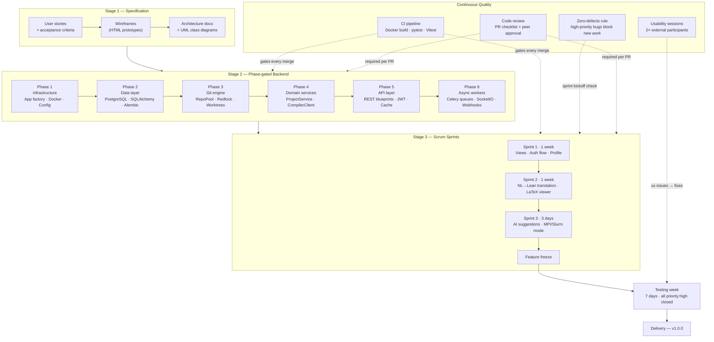
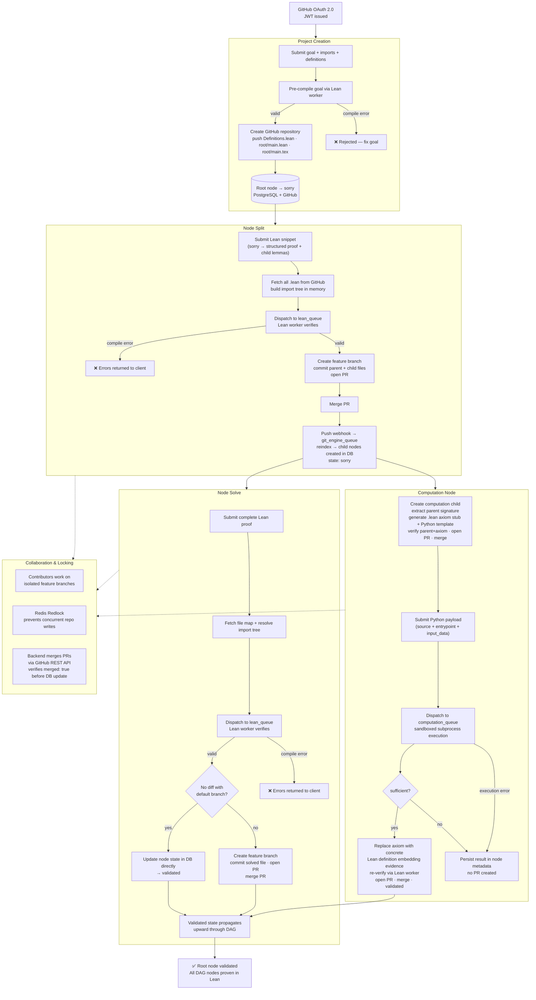
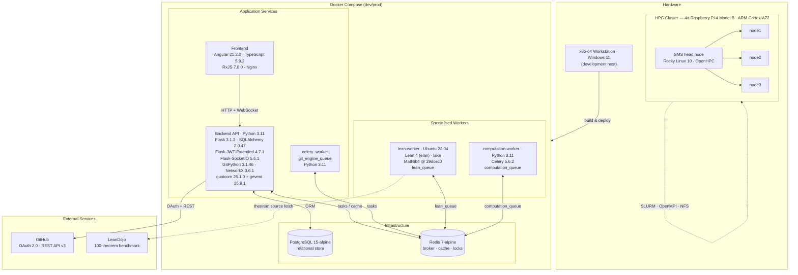

# Materials and Methods — CoProof (Draft)

## Materials

CoProof was developed and deployed across two hardware tiers. The development host was an x86-64 workstation running Windows 11; the computation cluster comprised four Raspberry Pi 4 Model B units (ARM Cortex-A72, 64-bit) connected over a private LAN (192.168.1.0/24), provisioned with Rocky Linux 10 (aarch64) and managed through OpenHPC, SLURM as the workload scheduler, and OpenMPI for distributed execution. All platform services were containerized with Docker and orchestrated via Docker Compose. The persistence layer used PostgreSQL 15 (Alpine) as the relational store and Redis 7 (Alpine) as both the message broker and distributed cache. The backend API was implemented in Python 3.11 (Debian Bookworm slim container) with Flask 3.1.3, SQLAlchemy 2.0.47, and Flask-Migrate 4.1.0 (Alembic) for schema management; psycopg2-binary 2.9.11 served as the PostgreSQL adapter. Authentication relied on JWT tokens issued through Flask-JWT-Extended 4.7.1, with GitHub OAuth 2.0 (scopes: `repo`, `read:user`, `user:email`) as the identity provider. Asynchronous task execution was handled by Celery 5.6.2 backed by Redis 7.2.1, with three isolated queues: `lean_queue`, `git_engine_queue`, and `computation_queue`. Real-time push notifications were delivered via Flask-SocketIO 5.6.1. Git operations—repository cloning, atomic worktree transactions, and pull request management—were issued programmatically using GitPython 3.1.46 against the GitHub REST API v3; theorem dependency graphs were represented in-memory with NetworkX 3.6.1. Production serving used gunicorn 25.1.0 with gevent 25.9.1 workers. Request/response serialization was handled by marshmallow 4.2.2. The frontend was built with Angular 21.2.0 and TypeScript 5.9.2, bundled via `@angular/cli` 21.2.0, using RxJS 7.8.0 for reactive HTTP communication; Nginx served the compiled static assets inside the frontend container.

The formal verification service ran in an isolated Ubuntu 22.04 container. Lean 4 was installed and version-managed through elan; the Lean toolchain version was pinned to the one declared in Mathlib4 at commit `29dcec074de168ac2bf835a77ef68bbe069194c5`, which was compiled in full via `lake exe cache get && lake build`. The compiled `LEAN_PATH` exposed seven Mathlib4 sub-packages: `Qq`, `aesop`, `Cli`, `importGraph`, `LeanSearchClient`, `batteries`, and `proofwidgets`. The service accepted proof snippets over a Celery task interface (`lean_queue`) and invoked the Lean 4 executable on temporary files, parsing compiler output to extract theorem names, line positions, error messages, and return codes. Verification correctness was evaluated on a 100-theorem benchmark derived from LeanDojo, sourcing raw `.lean` files from the public Mathlib4 GitHub repository at their respective commits. Benchmark analysis used matplotlib and numpy. The test suite across all Python services used pytest 9.0.2, pytest-flask 1.3.0, and pytest-mock; code quality was enforced with black and flake8.

---

## Methods

### Development Methodology

CoProof was developed by a three-person team using a hybrid methodology: a phase-gated discipline for the backend followed by Scrum-style sprints for frontend integration. The process began with a full specification layer — user stories with testable acceptance criteria, HTML wireframes for every principal view, and architecture documents with UML class diagrams per service — before any implementation began. The backend was then built across six sequential phases, each with an explicit exit condition: infrastructure and application factory, database schema and ORM models, stateless Git engine with distributed locking, domain service layer, RESTful API, and asynchronous task workers. Only once all six phases were stable did the team switch to three one-week sprints covering frontend views, the natural-language-to-Lean translation flow, and AI-assisted suggestions, followed by a hard feature freeze and a dedicated testing week.

Quality was maintained continuously through three mechanisms applied across all stages. A GitHub Actions CI pipeline executed the full Docker build, the pytest integration suite, and the Angular Vitest unit suite on every pull request, blocking any merge on failure. A zero-defects rule — adapted from Spolsky's formulation — required all high-priority bugs to be closed before new feature work began, enforced at each sprint kickoff. Every change additionally required peer code review against a mandatory checklist. Two structured usability sessions with external participants were conducted during the final testing week, with each friction point logged as a GitHub Issue and resolved before delivery.

### Development Process Overview

---

### Execution Methodology

At runtime, CoProof organises every user action around a proof graph: a directed acyclic graph (DAG) where each node maps one-to-one to a `.lean` file in a GitHub repository. A project begins when an authenticated user submits a goal statement; the backend pre-compiles that goal through the Lean verification service before creating the GitHub repository, then pushes three seed files — `Definitions.lean`, `root/main.lean`, and `root/main.tex` — and records a root node in `sorry` state in PostgreSQL. From that point, the user decomposes the proof by submitting node splits: Lean snippets that replace a `sorry` with a structured proof referencing new child lemmas. Each split is verified synchronously by the Lean worker before reaching GitHub; only a passing compilation triggers the creation of a feature branch and a pull request. Merging the PR fires a push webhook that reindexes the repository and creates the corresponding child nodes in the database, each inheriting `sorry` state. Leaf nodes are closed by submitting a complete proof via the solve endpoint, which follows the same verify-branch-PR cycle; validated states then propagate upward through the graph until the root is fully proven.

For sub-goals that require empirical or numerical evidence rather than a symbolic proof, the platform supports computation nodes. A computation node is created as a child of a proof node: the backend extracts the parent theorem's Lean signature, generates a child `.lean` stub using a typed axiom as placeholder, injects the axiom's import into the parent, verifies the combined files with Lean, and opens a PR with the new artifacts. The user then submits Python source code through the compute endpoint; the computation worker executes it in a sandboxed subprocess and returns a structured result with an evidence value and a `sufficient` boolean. If evidence is sufficient, the backend replaces the axiom with a concrete Lean definition embedding the evidence, re-verifies through the Lean worker, and opens a final PR. All write operations — splits, solves, and computations — are protected by Redis-based distributed locks that prevent concurrent modifications to the same repository.

### Proof Execution Flow

---

## System Overview

