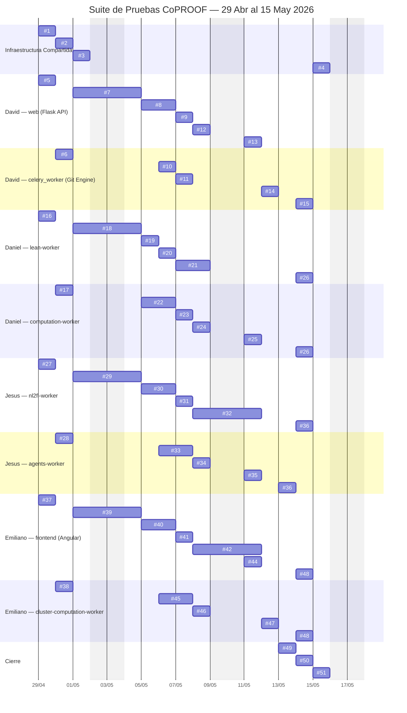

# Plan de Acción: Suite de Pruebas Exhaustiva de Microservicios — CoPROOF

---

## 1. Objetivo del Plan

Implementar una suite de pruebas automatizadas —unitarias, de integración y end-to-end— para cada uno de los diez contenedores de la plataforma CoPROOF (`web`, `celery_worker`, `lean-worker`, `computation-worker`, `cluster-computation-worker`, `nl2fl-worker`, `agents-worker`, `frontend`, `db`, `redis`), de modo que el equipo de desarrollo pueda detectar y corregir regresiones antes de que estas impacten a los usuarios finales de la plataforma. Al cierre del plan, cada microservicio backend deberá alcanzar ≥ 85 % de cobertura de líneas y ≥ 70 % de cobertura de ramas, el frontend ≥ 80 % de cobertura de statements, y el 100 % de los flujos E2E definidos en Cypress deberán ejecutarse sin fallos en el pipeline de CI/CD. Para lograrlo, el trabajo se distribuye en 51 acciones asignadas equitativamente a cuatro integrantes (David, Daniel, Jesús y Emiliano), utilizando exclusivamente herramientas open-source (`pytest`, `Jest`, `Cypress`, `fakeredis`, `testcontainers`) y el tier gratuito de GitHub Actions, sin requerir infraestructura adicional de pago. Esta iniciativa responde directamente a la necesidad del cliente: la ausencia de pruebas automatizadas expone a los usuarios de CoPROOF a fallos silenciosos en la verificación formal Lean 4, en la traducción NL→FL y en la gestión de versiones git, comprometiendo la confiabilidad del sistema como herramienta de demostración matemática colaborativa. Todas las suites estarán implementadas, ejecutadas y documentadas en un reporte consolidado de cobertura integrado al pipeline CI/CD antes del **15 de mayo de 2026**, a 17 días hábiles del inicio del plan (29 de abril de 2026).

---

## 2. Acciones, Recursos y Responsables

### Infraestructura Compartida (todos los integrantes)

| # | Acción | Fecha | Responsable | Recursos tecnológicos | Recursos económicos | Dependencias |
|---|---|---|---|---|---|---|
| 1 | Kick-off: análisis de microservicios, acuerdos de convenciones de testing y estructura de directorio `tests/` | 29 abr | Todos | Docker Engine ≥ 24, Docker Compose v2, Python 3.11, Node.js 20 LTS | $0 | Acceso al repositorio común |
| 2 | Configurar `docker-compose.test.yml` con todos los contenedores en modo test | 30 abr | Todos | Docker Compose v2, imágenes base de Docker Hub | $0 | Acción 1 completada |
| 3 | Crear `conftest.py` global con fixtures de DB, Redis, `factory_boy` y mocks LLM base | 01 may | Todos | `pytest 8.x`, `testcontainers-python`, `fakeredis`, `factory_boy`, `Faker` | $0 | `docker-compose.test.yml` funcional |
| 4 | Pipeline CI/CD GitHub Actions: `.github/workflows/test.yml` con matrix por servicio | 15 may | Todos | GitHub Actions (2 000 min/mes gratis), `pytest-html`, `codecov` | $0 | Todas las suites completadas |

---

### David — `web` (Flask API REST) + `celery_worker` (Git Engine)

| # | Acción | Fecha | Responsable | Recursos tecnológicos | Recursos económicos | Dependencias |
|---|---|---|---|---|---|---|
| 5 | Inventario de endpoints y diseño de casos de prueba para `web` | 29 abr | David | Revisión de `server/app/api/` (auth, projects, nodes, translate, agents, webhooks) | $0 | Acción 1 |
| 6 | Diseño de casos de prueba para `celery_worker` git tasks | 30 abr | David | Revisión de `server/celery_worker.py` y `app/services/git_service.py` | $0 | Acción 1 |
| 7 | Unit tests — autenticación, JWT y GitHub OAuth callback | 01–02 may | David | `pytest-flask`, `pytest-mock`, `fakeredis`, `responses` (mock GitHub OAuth) | $0 | Acción 3 (fixtures globales) |
| 8 | Unit tests — endpoints `/projects` y `/nodes` | 05–06 may | David | `pytest-flask`, `factory_boy` (fixtures `NewProject`, `NewNode`) | $0 | Acción 7 (auth funcional) |
| 9 | Unit tests — `/translate`, `/agents` y `/webhooks` | 07 may | David | `pytest-flask`, `responses` (mock de tasks Celery con ALWAYS_EAGER) | $0 | Acción 8 |
| 10 | Unit tests git tasks — clone, commit y push | 06 may | David | `pytest-celery` (`CELERY_TASK_ALWAYS_EAGER=True`), `responses` (mock GitHub REST), `tempfile`, `GitPython` | $0 | Acción 6; `fakeredis` como broker |
| 11 | Unit tests git tasks — merge, PR y no-op solve | 07 may | David | `responses` (mock GitHub merge endpoint), `pytest-mock` | $0 | Acción 10 |
| 12 | Integración `web` ↔ PostgreSQL via SQLAlchemy | 08 may | David | `testcontainers[postgres]`, `pytest-flask` | $0 | PostgreSQL en `docker-compose.test.yml` |
| 13 | Integración `web` ↔ Redis y Celery queues | 11 may | David | `testcontainers[redis]`, `pytest-celery` | $0 | Redis en `docker-compose.test.yml` |
| 14 | Integración `celery_worker` ↔ GitHub API mock | 12 may | David | `responses`, personal access token de cuenta de desarrollo (gratuito) | $0 | Acciones 10–11 completadas |
| 15 | Reporte de cobertura `web` + `celery_worker` | 14 may | David | `pytest-cov`, `pytest-html` | $0 | Acciones 12–14; cobertura objetivo ≥ 85 % |

---

### Daniel — `lean-worker` + `computation-worker`

| # | Acción | Fecha | Responsable | Recursos tecnológicos | Recursos económicos | Dependencias |
|---|---|---|---|---|---|---|
| 16 | Análisis de `lean_service.py`, configuración de `elan` y localización del ejecutable Lean 4 | 29 abr | Daniel | Imagen Docker `lean-worker`, Lean 4 (open-source), `elan` | $0 | Acción 1 |
| 17 | Análisis de `computation_service.py` y funcionamiento del sandbox subprocess | 30 abr | Daniel | Python 3.11, revisión de `computation/computation_service.py` | $0 | Acción 1 |
| 18 | Unit tests lean-worker — verificación de snippets Lean 4 válidos | 01–02 may | Daniel | `pytest`, `subprocess` mock (sin invocar Lean real), `pytest-mock` | $0 | Acción 3 |
| 19 | Unit tests lean-worker — snippets inválidos y edge cases de errores del compilador | 05 may | Daniel | `pytest`, fixtures de snippets con errores de tipo conocidos | $0 | Acción 18 |
| 20 | Unit tests lean-worker — `parse_theorem_info`: teoremas, lemas y definiciones complejos | 06 may | Daniel | `pytest`, módulo `re` stdlib | $0 | Acción 18 |
| 21 | Integración `lean-worker` ↔ Redis/Celery | 07–08 may | Daniel | `testcontainers[redis]`, `pytest-celery`, imagen `lean-worker` construida (~5–10 min primer build) | $0 | `docker-compose.test.yml`; imagen construida |
| 22 | Unit tests `computation-worker` — sandbox: ejecución aislada Python, retornos correctos | 05–06 may | Daniel | `pytest`, `unittest.mock.patch` sobre `subprocess.run`, `tempfile` | $0 | Acción 17; acción 3 |
| 23 | Unit tests `computation-worker` — `normalize_result`: tipos de retorno, edge cases | 07 may | Daniel | `pytest`, fixtures con variantes de `dict` y `tuple` | $0 | Acción 22 |
| 24 | Unit tests `computation-worker` — timeouts y excepciones del sandbox | 08 may | Daniel | `pytest-timeout`, `unittest.mock` para `subprocess.TimeoutExpired` | $0 | Acción 22 |
| 25 | Integración `computation-worker` ↔ Redis/Celery | 11 may | Daniel | `fakeredis`, `pytest-celery` | $0 | Acción 2; acciones 22–24 |
| 26 | Reporte de cobertura `lean-worker` + `computation-worker` | 14 may | Daniel | `pytest-cov`, `pytest-html` | $0 | Acciones 21, 25; cobertura objetivo ≥ 85 % |

---

### Jesús — `nl2fl-worker` + `agents-worker`

| # | Acción | Fecha | Responsable | Recursos tecnológicos | Recursos económicos | Dependencias |
|---|---|---|---|---|---|---|
| 27 | Análisis de `nl2fl_service.py`: flujo retry LLM, providers y ciclo de retroalimentación | 29 abr | Jesús | Revisión de `nl2fl/nl2fl_service.py` | $0 | Acción 1 |
| 28 | Análisis de `agents_service.py`: cuatro providers y system prompt | 30 abr | Jesús | Revisión de `agents/agents_service.py` | $0 | Acción 1 |
| 29 | Unit tests `nl2fl-worker` — llamadas LLM con los cuatro providers mockeados | 01–02 may | Jesús | `pytest`, `responses` (mock REST APIs de OpenAI, Anthropic, Google, DeepSeek), `pytest-mock` | $0 | Acción 3 |
| 30 | Unit tests `nl2fl-worker` — ciclo retry con errores del compilador Lean inyectados | 05–06 may | Jesús | `pytest`, fixtures de errores Lean (cadenas de texto conocidas) | $0 | Acción 29 |
| 31 | Unit tests `nl2fl-worker` — historial de intentos, respuesta vacía y provider desconocido | 07 may | Jesús | `pytest`, `pytest-mock` | $0 | Acción 29 |
| 32 | Integración `nl2fl-worker` ↔ `lean-worker` via Celery (pipeline completo) | 08–11 may | Jesús | `pytest-celery`, imagen `lean-worker` construida, `fakeredis` | $0 | Acción 21 (lean-worker integrado); acción 3 |
| 33 | Unit tests `agents-worker` — providers OpenAI, Anthropic, Google, DeepSeek y `mock/` | 06–07 may | Jesús | `pytest`, `responses`, proxy Copilot local (`http://host.docker.internal:8000`) | $0 | Acción 28; acción 3 |
| 34 | Unit tests `agents-worker` — system prompt, timeout 120 s y HTTP 429 rate limit | 08 may | Jesús | `pytest`, `pytest-timeout`, `responses` (mock 429) | $0 | Acción 33 |
| 35 | Integración `agents-worker` ↔ Redis/Celery | 11 may | Jesús | `fakeredis`, `pytest-celery` | $0 | Acción 3 |
| 36 | Reporte de cobertura `nl2fl-worker` + `agents-worker` | 13–14 may | Jesús | `pytest-cov`, `pytest-html` | $0 (unit/integración); ~$2–5 USD opcional si se usan tokens LLM reales | Acciones 32, 35; cobertura objetivo ≥ 85 % |

---

### Emiliano — `frontend` (Angular) + `cluster-computation-worker`

| # | Acción | Fecha | Responsable | Recursos tecnológicos | Recursos económicos | Dependencias |
|---|---|---|---|---|---|---|
| 37 | Análisis de componentes y servicios Angular (`AuthService`, `TaskService`, rutas, guards) | 29 abr | Emiliano | Angular CLI 17, Node.js 20, revisión de `frontend/src/app/` | $0 | Acción 1 |
| 38 | Análisis de `cluster_computation/computation_service.py` y `cluster_api` HTTP endpoints | 30 abr | Emiliano | Revisión de `cluster_computation/`, `cluster_api/app.py` | $0 | Acción 1 |
| 39 | Unit tests Angular — `AuthService` y `auth.guard` | 01–02 may | Emiliano | `Jest` + `jest-preset-angular`, `Angular TestBed`, `RouterTestingModule`, `HttpClientTestingModule` | $0 | Acción 3 |
| 40 | Unit tests Angular — `TaskService` y HTTP interceptors | 05–06 may | Emiliano | `HttpClientTestingModule`, `RouterTestingModule` | $0 | Acción 39 |
| 41 | Unit tests Angular — componentes de páginas principales (creación de proyecto, validación, traducción) | 07 may | Emiliano | `Angular TestBed`, `msw` (Mock Service Worker) para simular API `web` | $0 | Acción 40 |
| 42 | E2E Cypress — flujo de autenticación GitHub OAuth | 08–09 may | Emiliano | `Cypress ≥ 13`, cuenta de GitHub de desarrollo (gratuita) | $0 | Acción 39; servidor `web` o MSW disponible |
| 43 | E2E Cypress — flujo completo: crear proyecto → validar nodo → traducir | 09–10 may | Emiliano | `Cypress`, `cy.intercept` para control de timing, `msw` | $0 | Acción 42; API `web` mock vía MSW |
| 44 | Integración `frontend` ↔ `web` API vía Mock Service Worker | 11 may | Emiliano | `msw`, `Jest`, `HttpClientTestingModule` | $0 | Acciones 41–43 |
| 45 | Unit tests `cluster-computation-worker` — polling y transiciones PENDING/RUNNING/COMPLETED | 06–07 may | Emiliano | `pytest`, `responses` (mock `cluster_api` REST), `pytest-mock` | $0 | Acción 38; acción 3 |
| 46 | Unit tests `cluster-computation-worker` — edge cases: `TIMEOUT`, `NODE_FAIL`, `CLUSTER_API_KEY` vacía | 08 may | Emiliano | `pytest`, `responses` | $0 | Acción 45 |
| 47 | Integración `cluster-computation-worker` ↔ `cluster_api` mock | 12 may | Emiliano | `responses`, `fakeredis`, `pytest-celery`, variable `CLUSTER_API_URL` configurable | $0 (red lab física: sin costo) | Acciones 45–46 |
| 48 | Reporte de cobertura `frontend` + `cluster-computation-worker` | 14 may | Emiliano | `pytest-cov`, `Jest --coverage`, `pytest-html` | $0 | Acciones 44, 47; cobertura objetivo ≥ 80 % |

---

### Cierre (todos los integrantes)

| # | Acción | Fecha | Responsable | Recursos tecnológicos | Recursos económicos | Dependencias |
|---|---|---|---|---|---|---|
| 49 | Ejecución de suite E2E completa con `docker-compose.test.yml` (todos los contenedores) | 13 may | Todos | `docker-compose.test.yml`, `pytest`, `Cypress` | $0 | Todas las suites unitarias e integración completadas |
| 50 | Análisis de fallos E2E y correcciones finales | 14 may | Todos | Logs de `pytest-html`, panel de Cypress | $0 | Acción 49 |
| 51 | Reporte consolidado de cobertura y merge del pipeline CI/CD a `main` | 15 may | Todos | `codecov`, `pytest-html`, GitHub Actions | $0 | Acción 50; todos los reportes individuales |

---

## 3. Carta de Gantt

